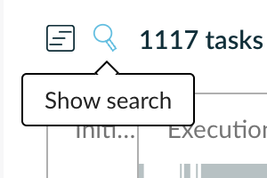
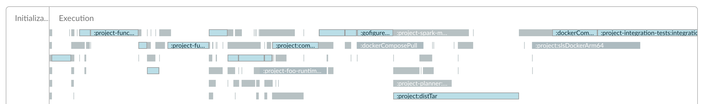
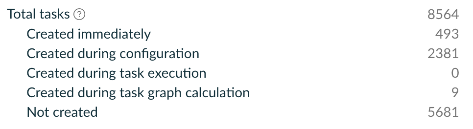
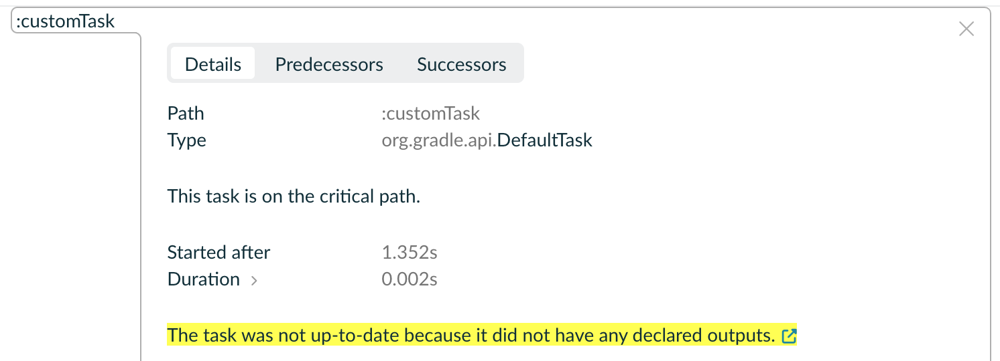
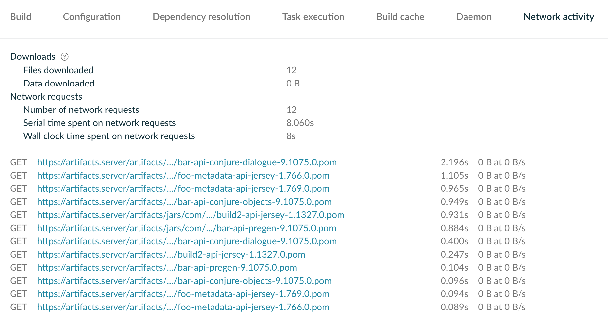
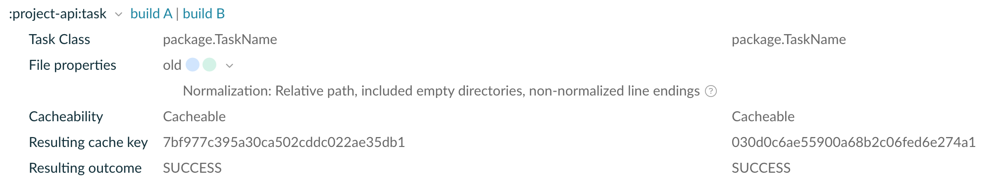

<!-- PreviousNext:START -->
<table><tr>
    <td>Previous: <a href="managed-types-and-properties.md#">Managed Types and Properties</a></td>
    <td align="center"><a href="../README.md##table-of-contents">Table of Contents</a><td>
</tr></table>
<!-- PreviousNext:END -->

# Diagnosing Build Performance

In this guide, we'll cover:

1. What to expect of your build performance in an ideal situation
2. How to use Gradle Build Scans to find performance issues in your Gradle builds.
3. How to work what is causing the performance issue
4. (Hopefully) how you can fix the issue.

## Expectations of performance

This can be split into two sections: what should be expected for local builds, and what should be expected for CI builds.

### Local builds

Local builds should be fast for common actions like compilation and starting tests (after the first run). If you're waiting more than a few seconds for your unit tests to start with a warm cache, then this is non-ideal and should be improved.

It's acceptable to wait slightly longer for tasks that are run less frequently (writing locks, starting integration test infra); however, they should aim to do the minimal amount of work and be incremental, so if only a small change is made, only a small amount of work needs to be done.

When the same Gradle invocation is run two times in a row, the second invocation should do virtually nothing. All the tasks should be up-to-date and do no work. The task should be setup so that Gradle can keep track of the all the inputs and outputs and know whether it needs to rerun the build[^1].

[^1]: This is not always possible - especially when the output isn't a file Gradle can keep track of. The typical example is Docker Images in the Docker Daemon. In these cases, the task can always run but should delegate to some external mechanism that does efficient caching - for Docker this is the layer caching when building images.

### CI Builds

10 minutes seems to be where a CI build goes from being "acceptable" to being painful; certainly once it starts getting to 15/20+ minutes it will actively slow down developers. Obviously, the faster a CI build the better. If it can be reduced or minutes or even seconds - incredible.

If possible, errors should be displayed in the build output as soon as possible rather than waiting for the build to finish. This will enable developers following along to immediately action to error rather than waiting for the whole build to finish.

## Finding a build scan

The best way to diagnose Build Performance is to use Gradle Build Scans. Either you can pay and setup Develocity yourself for your organisation, or you can use the free hosted version for open source projects at https://scans.gradle.com.

Once enabled, any time you run a Gradle build, you can find a link to the build scan at the end of the build output. It will look something like:

```
Publishing build scan...
https://build.scan.server/s/abcdefg
```

Simply click the link.

On CI, you'll need to scroll to the bottom of output of the Gradle invocation you're interested about to find the link.

## Tasks: How to diagnose performance issues

Step one is to get a build scan of the particular situation you care about and load it up.

### Look at the Critical Path

Build scans can be very large with an overwhelming amount of tasks. Some tasks may take long time but happen in the "background" so not really matter - what we care about is the "Critical Path". This is set of tasks that if any of them took less time, the build would finish faster overall. No tasks in the Critical Path should overlap.

Go to the Timeline tab, then hit the search symbol:



Then check the "On critical path" checkbox in bottom-right corner of the search pane that just expanded.


This will now highlight all the tasks that are on the critical path:



These are the ones we should focus on improving/removing!

### Work out if there's anything wrong with these tasks

Take a look at each task in the Critical Path - is there something wrong with each of them? [Listed below are common issues with tasks](#common-perf-issues).

This may require some intimate knowledge of the various tasks in the build system. Bear in mind your performance expectations:

* If you change a single file in a large set of files (ie a single Java source file), should it take that task the same amount of time to incrementally process that one file as rebuilding everything?
* Is this task never up-to-date? Does it always run, even when nothing has changed?
* Is this task even necessary for later task?
* Is it dramatically slower than other tasks of the same type for some reason?
* [Lots of examples listed below](#common-perf-issues).

It's probably best to start with the longest tasks, as they are likely to have the best chance of producing a large speedup.

### Fix any issues you find

Assuming you've found some problems with the current critical path, implement fixes to try to reduce or remove the task runtime (the common problems below have example fixes you may be able to adapt).

### Run the Gradle build again and repeat

Run the Gradle build again and repeat the process. By speeding up certain tasks you may now have a different critical path, with a different set of tasks.

Keep optimising these tasks you are able to in the critical paths until you are happy with the build time, can't improve anything anymore, or have run out of time.

## Configuration: How to diagnose performance issues

Tasks are not always the problem.

Gradle builds are split into several stages. An initial stage is the "configuration" stage where all the Gradle build scripts are parsed and run, all the plugins are applied, the required task objects etc are created.

This can often be slow - in fact, it is often worse for configuration to be slow than individual tasks, as when Gradle is being run locally the configuration cost is paid every single Gradle invocation[^3] and may dominate the overall build time.

[^3]: One day, we may update our full corpus of 9+ year old Gradle plugins to support [Configuration Cache](https://docs.gradle.org/8.7/userguide/configuration_cache.html), but that is a long way off.

It's _much_ harder to analyse why configuration is going wrong than tasks - there is much less telemetry in the Gradle Build Scans.

You can spot when this is a problem when your build scan looks like this (huge "Initialization & configuration" compared to "Execution" section):


Or when just running the build you see it stopped for ages at `CONFIGURING` rather than `EXECUTING`:

```
<-------------> 6% CONFIGURING [10s]
```

There are few way to work out what's happening here:

### Use Performance tab

The Performance tab in the build scan can give you some insight into what's taking the most time. It's not as detailed as the Timeline tab, but it can give you some hints.

#### Configuration subsection

This tells you how long each part of configuration took. It breaks down how long scripts and plugins took to apply so you can at least see where the general source of the pause is.

It also tells you the number of tasks created during the build. In modern Gradle, tasks should be registered lazily so they do not actually get turned into a real "expensive" instance until they are actually needed. If you see a large number of tasks created fro a relatively small build, this _may_ be a perf problem:



#### Dependency Resolution subsection

This tells you how long it took to resolve different Configurations that represent sets of dependencies.

It's a bit hard to determine what's bad here, as each dependency may or may not be cached and reused across many Configurations. You may have to work back from a particular slow download on the Performance > Network tab, then look it up which configuration it belongs to in the Dependencies tab.

#### Network Tab subsection

This is helpful to see which dependencies take a long time to download.

> Note: it only includes downloads that Gradle is aware of - if you have a task that yolo downloads something (eg the extremely bad undercouch Download task) it will not appear here (and also be unlikely to be cached - move this to built in Gradle dependency management asap).

### Record a Java Flight Recording

Use the internal Gradle plugin `gradle-jfr` to take a Java Flight Recorder file of the daemon process (follow the readme). 

Analyse this JFR using Java Mission Control to see which code is taking the most time. This is a skill and not necessarily easy to comprehend at first.


## Common perf issues

Here are a list of the most common Gradle Build Perf issues:

### Task is never up-to-date

When tasks are never up-to-date, they rerun each time. This is much more likely to appear in custom Gradle script tasks than plugin code.

In the build scan, by clicking on the task, you can see why it was not up-to-date:



A good way to check your build for these kind of tasks is to just run the same Gradle invocation twice and look at the second build scan. Everything should be up-to-date[^1].

#### Not declaring task outputs

This is a common problem with poorly written custom Gradle script tasks. For example, this is a bad way people sometimes write tasks:

```gradle
def outputFile = file('build/output')
def inputFile = file('build/input')

task customTask {
    doLast {
        outputFile.text = inputFile.text + 'extra data'
    }
}
```

This task does not declare any inputs or outputs, so the build scan says:

```
The task was not up-to-date because it did not have any declared outputs.
```

If we tell Gradle about the output [like so](https://docs.gradle.org/8.7/userguide/incremental_build.html#sec:task_input_output_runtime_api):

```gradle
task customTask {
    outputs.file(outputFile)
    doLast {
        outputFile.text = inputFile.text + 'extra data'
    }
}
```

This fixes the immediate up-to-date problem.

However, this code is still very bad! It doesn't register the input either, and it's very error-prone to write custom tasks in Gradle scripts like this. Ideally, it should be replaced by either:

1. A custom task written in Gradle plugin in Java that is [properly annotated](https://docs.gradle.org/8.7/userguide/incremental_build.html#sec:task_input_output_annotations) with `@OutputFile`/`@InputFile` etc. 
1. Gradle provided common tasks (`Copy`, `Sync`, `Tar` etc) which set up the inputs and outputs properly based on the configuration you give it

#### Overlapping task outputs

This is a similar situation where two tasks output to the same directory. Gradle cannot keep track of which files came from which tasks.

The fix is to more accurately describe each of the outputs of each of the tasks. Rather than listing an entire directory as an output, you can list the individual files.

If the outputs are dynamically generated based on input files, you can give `getOutputs().files(` a `Property` that is lazily calculated.

#### Manually forced to never be up-to-date

Tasks are sometimes forced to never be up-to-date by this snippet of Gradle:

```gradle
task.upToWhen { false }
```

This is sometimes for correctness - but has been used as an unnecessary kluge to fix problems with inputs not being listed properly. Each situation needs some though about whether this can be replaced by better input specifications. 

### Needlessly included tasks

In Gradle, there are two ways to declare task dependencies:

1. Using [Providers](https://docs.gradle.org/8.7/userguide/lazy_configuration.html), you can say that the [input of one task is the output of another](https://docs.gradle.org/8.7/userguide/lazy_configuration.html#working_with_task_dependencies_in_lazy_properties). This automatically links up the tasks with a dependency between them, and is the modern, accurate way of handling task deps. 
2. Using `dependsOn`, you can link together arbitrary tasks regardless of which inputs they actually use. This is "old" way (although still used for marker tasks with no inputs/outputs eg `check`).

The problem with `dependsOn` is it makes it very easy to add tasks dependencies that are unnecessary. For example, if a tasks only needs container images, but for some reason the build scan shows that it currently requires distribution tars to be created as well - that is probably a bug that is slowing down the build.

It's also possible to depend on a successor task - for example depending on `jar` task when you just need the classes (`classes` task) or the resources (`processResources` task).

Try to find out what is setting up the dependency:
* If it's a custom task in a Gradle script, you can look where it's declared.
* If it's from a Gradle plugin, it probably has a custom type that listed in the build scan. Use this to find where it's declared in the plugin and how dependencies are set up.
* Look in the Gradle build script for the project the task lives in too, someone may have added this manually.

Once you've removed this task dependency it should speed up the build - and may have knock on benefits too (like allowing more tasks to run in parallel).

### Non-incremental tasks

Non-incremental have all their outputs deleted[^2] before they run and so even if a tiny fraction of their input changes, they repeat work by regenerating all of the output.

[^2]: Technically, it is Gradle that deletes non-incremental task outputs automatically.

Almost all custom Gradle tasks are initially built non-incrementally, as building incremental tasks is harder and requires much more thought. A task may be fine as non-incremental, until it is exposed to a repo that such scale that it starts to take an unnecessarily long time.

The solution here is put in the effort to [make this task incremental](https://docs.gradle.org/8.7/userguide/custom_tasks.html#incremental_tasks).

### Avoid archiving and unarchiving

Avoid having a task `A` that archives data then a later task `B` that unarchives that data. Just use the input data for `A` as the input of archival task `B` too.

Particularly with distributions - there is no need to tar up 100s of megabytes of data just to then extract it later (eg when building a container image). 

#### Using compilation output: classes vs jars

It's pretty common to use the output of compilation as task input: either for running code or to analyse the bytecode to find certain method invocations etc.

Where possible classes should be consumed rather than jar files (jars are essentially just archives of classes). This has multiple benefits:

* When running incrementally, the "unit" of change is smaller. If someone just modifies a single class, we only have do incremental work on that class rather than the whole jar full of classes.
* It's a common pattern to put a version number in jar files, usually in the manifest or somewhere else in `META-INF`. If the versions numbers have commit hashes in, this will destroy the up-to-date-ness of the task consuming the jars, even if nothing in the actual class files have changed.
* Sometimes expensive operations run part of `processResources`. Just consuming class files avoid this processing resources entirely.

### Over-broad constraints/versions.props pins

You may be suffering from this if you notice your build is always pausing whenever you invoke Gradle trying to download a particular version of a library that takes a long time to resolve. It looks like it's paused on a dependency like this:


You can also see these in the Performance > Network tab in the build scan (8 seconds wasted in this example! Note the `0 B` transferred - indicates a 404):



This is likely because you have a `*` entry in `version.props` (or generally a constraint) which is "over-broad" - it's applying to more dependencies than it should.

For example, given this `versions.props`:

```properties
org.junit.*:* = 5.10.2
```

And in `versions.lock` you see you have these two dependencies:

```
org.junit.jupiter:junit-jupiter:5.10.2
org.junit.platform:junit-platform-commons:1.10.2
```

Since `5.10.2` > `1.10.2`, whenever Gradle tries to resolve `org.junit.platform:junit-platform-commons`, it first tries version `5.10.2` thanks to the `versions.props` pin. This returns a 404, and it falls back to trying the next constraint `1.10.2`, which works.

However, that 404 can be very expensive. In particular, if you are hitting an Artifactory virtual repository, which is backed by many upstream Maven repositories, Artifactory will try each of these upstreams serially until it gets a 200. This can take many seconds. You can see this by appending `?trace` to the Artifactory url.

The solution is break up the over-broad versions prop into non-overlapping pieces:

```
org.junit.jupiter:* = 5.10.2
org.junit.platform:* = 1.10.2
```

### Slow network requests

You can go to Performance > Network in the build scan to see how long each network request took.

If it is from Artifactory, you can further work out why it is slow by visiting the url with `?trace` appended. This will show you what Artifactory is actually doing under the covers.

### Network requests outside of Gradle's framework

If you use Gradle to download a dependency, it will automatically handle caching it for you.

If you choose to use another mechanism to download artifacts, it will not be cached by Gradle and may be downloaded every single time you run Gradle. It will definitely be downloaded every single time you run CI (we save the Gradle cache and nothing else between CI builds). It will not appear in the Performance > Network tab in the build scan (essentially invisible).

A particularly bad example is the "undercouch Download" task. This is often used but pretty much should never be.

Instead, you can make a new Configuration for your artifact:

```gradle
configurations {
    myArtifact
}

dependencies {
    myArtifact 'com.example:artifact:1.0'
}

task doSomethingWithArtifact(type: Blah) {
    from configurations.myArtifact
}
```

If it's not in a maven layout, you can make [an Ivy repository](https://docs.gradle.org/8.7/userguide/declaring_repositories.html#sec:ivy_repositories) (which lets you specify arbitrary layouts) and use that:

```gradle
repositories {
    ivy {
        url 'https://example.com/repo'
        layout 'pattern', {
            artifact '[organisation]/[module]/[revision]/[artifact]-[revision].[ext]'
        }
        content {
            onlyForConfigurations 'myArtifact'
        }
    }
}
```

### Error-prone/compilation being slow

At Palantir, we extensively use [Error Prone](https://errorprone.info/) (which is a Java compiler plugin developed by Google) to find issues with Java code at compile time. We've [added a deal of our own checks](https://github.com/palantir/gradle-baseline/tree/develop/baseline-error-prone/src/main/java/com/palantir/baseline/errorprone) to add significant safety and catch bugs before they even get to code review.

It has high upside, but the downside is it slows down compilation, usually by 1.5-2x for normal code. However, some code (especially some generated code) can make these checks enter degenerate states which have poor performance, dramatically extending compilation time.

We can verify that error prone is the cause of the slowness by turning it off:

1. First run you compile tasks as normal but with `--rerun-tasks` (eg `./gradlew compileJava compileTestJava --rerun-tasks` etc).
2. Then run the same command but with `-Pcom.palantir.baseline-error-prone.disable`.
3. Using buildscans, compare the compile tasks times (ensure they were not up-to-date/actually ran again)

If there is slowness, there's a few things you can try:

* If it is slow on generated code, the generated code is not marked as generated properly and error prone is not ignoring it. Try putting in the `build/` directory where it belongs, which error prone will detect as generated.
* Use the internal Gradle plugin `gradle-jfr` to take a Java Flight Recorder file of the compile processes (follow the readme).
  * Analyse this JFR using Java Mission Control to see which error prone check(s) are taking the most time.
  * Ideally make a PR to fix them
  * Otherwise, you can disable the error prone - provided it isn't essential for security.

### Compilation not being incremental

Sometimes, the `compileJava` etc tasks themselves do not run incrementally. You can detect this by seeing that even if you compile, just change one class, then recompile, it is not very fast.

You can check if the compilation is being run incrementally by running `./gradlew` with `--info` to get info level logging. If you:

1. Run `./gradlew compileJavaTaskName -i`
2. Change a class in the source dir for that compile task
3. Run `./gradlew compileJavaTaskName -i`

4. It should have this at the end of the compilation task:

> Incremental compilation of 3 classes completed in 1.413 secs.

If incremental compilation is not enabled it should say so and hopefully tell you why.

### Unrelated tasks not running in parallel within the same project

If two tasks do not have dependency between them (they are "unrelated") and ready to run at the same time, they should scheduled by Gradle to run at the same time to speed up the build.

When unrelated tasks are in different projects, they pretty much always run in parallel with each other.

However, tasks in the same project must _both_ conform to some [very strict criteria](https://docs.gradle.org/8.7/userguide/configuration_cache.html#config_cache:requirements)[^4] for them to be run in parallel.

You can notice this on the build scan by seeing when one unrelated task starts immediately after the other finishes, rather than overlapping:


To solve this, we have to ensure both the tasks are parellelisable. There are two options:

1. Ensure that all the [very strict criteria](https://docs.gradle.org/8.7/userguide/configuration_cache.html#config_cache:requirements)[^4] are met both tasks.
   1. The main part is that tasks should not take "complicated", mutable Gradle domain types as inputs, such as `Project`, `Configuration`, `SourceSet`, `Dependency` etc.
   2. Any task that calls `getProject()` or really any method on the `Task` interface inside a task action will not be parallelisable[^5]. 
   3. This is so that Gradle knows it can safely run the two tasks in parallel, otherwise there would be modification of shared mutable non-threadsafe state.
2. Use the [auto-parallelisable](https://github.com/palantir/auto-parallelizable) annotation processor. This forces all your input types to be `Serializable`, which none of the complicated mutable Gradle domain types are. It also uses the [Worker API](https://docs.gradle.org/8.7/userguide/worker_api.html) to directly tell older versions of Gradle that the task is parallelisable.
3. If it's a custom task in a Gradle build script, either promote it to a Gradle plugin written in Java or use a Gradle provided task (they are all parallelisable now).

[^4]: This is actually what's needed to make the task configuration-cacheable, which is more strict than just being parallelisable within the same project. There is no real docs on what is needed to make tasks parallelisable within the same project, unfortunately.

[^5]: Gradle actually does this by analysing and instrumenting every class file inside every jar of the buildscript classpath!

> Note: Even if two unrelated tasks in the same project `A` and `C` can be run in parallel, if `C` depends on another task `B` that is not parallelisable, then `C` will wait until `B` is finished. This may be after `A` is finished as `A` and `C` cannot be run in parallel, depending on how tasks are scheduled.

### Tasks marked as Cacheable but do not cache between machines

An exciting feature of Gradle is the [Build Cache](https://docs.gradle.org/8.7/userguide/build_cache.html) - this can allow CI builds to save the outputs of tasks to a server then local builds can just use these outputs rather than running the tasks again.

You can check to see whether build caching is working properly by just cloning the main branch with zero local changes then running a Gradle build. Tasks like `compileJava` should be cached and not run - and in the build scan will say `FROM-CACHE`.

The real tricky part of making tasks Cacheable is getting the inputs to the cache key right. A common problem is that the inputs to the cache key are different on CI and locally. This means that the local machine never gets the cache hits. The build scan should tell you whether a task is cacheable or not by saying `FROM-CACHE` or nothing at all.

If the task is not cacheable, it will say why:


If the inputs are different, you can see the different cache keys - but this isn't that helpful. So you can use a build scan comparison to see the differences between the two cache inputs:

1. Take your two build scans `https://build.scan.server/s/abcdefg` and `https://build.scan.server/s/hijklmn`.
2. Go to the URL `https://build.scan.server/c/abcdefg/hijklmn`.

This will show you the "task inputs" and may tell you what's different between the two:



> Note: The cache key includes hashes of the all the jars in buildscript classpath. If a plugin jar is added, removed or upgraded, all cache keys are invalidated.

### Making stuff Cacheable unnecessarily

It's very easy to tell Gradle that something is (Build) Cacheable - you just need to slap on a `@CacheableTask` or `@CacheableTransform` annotation (or set `outputs.cacheIf { true }` in Gradle scripts).

However, caching comes with costs:

1. A network call must be made before the task runs to determine if the caching server has a value for that cache key.
2. If already cached, the task outputs must be downloaded over a network connection that may be slow.
3. If uncached and a CI build, the task outputs must be uploaded to the caching server, again over a possibly slow network connection.

If the task is very fast, the cost of the cache may be more than the cost of the task itself. Gradle themselves recommend that you do not cache archive tasks and other tasks that just move bytes around - generally this will be faster on your machine that downloading from the network. You can cache inputs to these archive tasks though, such as compilation.

You can see the savings in the build scan details:


If the "avoidance savings" are negative, that's bad - it took longer to download the cache than to just run the task.

You can also see the overall performance of the Build Cache in the build scan under Performance > Build Cache.

It's particularly bad for cacheable [Artifact Transforms](https://docs.gradle.org/8.7/userguide/artifact_transforms.html). In the worse case, you can have hundreds of files in your transform, each individually being transformed, each of which has an individual network overhead:

```
:taskName > Requesting from remote build cache
:taskName > Requesting from remote build cache
:taskName > Requesting from remote build cache
:taskName > Requesting from remote build cache
:taskName > Requesting from remote build cache
:taskName > Requesting from remote build cache
:taskName > Requesting from remote build cache
```

In these cases, unless each artifact transform takes seconds or longer to run, it's probably not worth caching.

